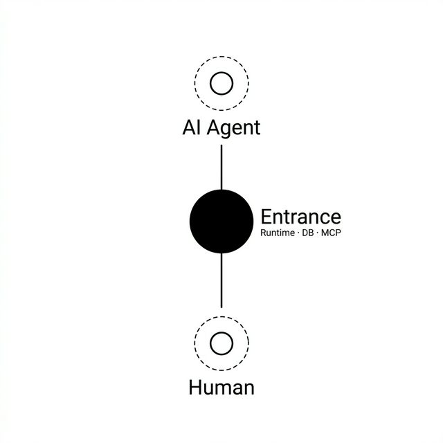

# Entrance

**Local control plane for coding automation.**

*One Rust binary for durable notes, task ledgers, local secrets, launchers, and a desktop bridge.*

> Entrance keeps project-side state close to the machine:
> persistent notes, a small task ledger, local AES-GCM vault records, app indexing, and a GUI bridge over one runtime.

当前版本是 **V2 Microkernel Preview**：一个 `entrance` 程序提供 CLI 和后台 daemon；桌面端使用 Electron + SolidJS，并通过同一个 daemon 协议调用 Rust runtime。

---

## 一图看懂 / Architecture



---

## Runtime Surfaces

### Drawer

Durable local storage for notes, imported files, vault records, and version snapshots.

```powershell
.\entrance.exe drawer memory import --title "登录页重构进度" --body "auth middleware 已修，下一步补集成测试"
.\entrance.exe drawer list
.\entrance.exe drawer history
```

```powershell
.\entrance.exe drawer vault store --title "OpenAI" --secret "sk-..."
.\entrance.exe drawer vault list
```

### Hive

Task ledger for dispatch records, engine reports, callbacks, and review state.

```powershell
.\entrance.exe hive dispatch --title "修复登录页 500 错误"
.\entrance.exe hive summary
.\entrance.exe hive engine 1
.\entrance.exe hive review 1 approve
```

Local agent-loop MVP:

```powershell
.\entrance.exe hive loop demo --runtime codex --worker-timeout-secs 90 --worker-attempts 1 --compact
.\entrance.exe hive loop start --title "README loop" --goal "Run a constrained agent loop" --runtime codex --worker-timeout-secs 90 --worker-attempts 1 --compact
.\entrance.exe hive loop create --title "README loop" --goal "Run a constrained agent loop" --runtime codex --compact
.\entrance.exe hive loop run 1 --runtime codex
.\entrance.exe hive loop run 1 --runtime codex --compact
.\entrance.exe hive loop run 1 --runtime local --decision needs-review
.\entrance.exe hive loop show 1
.\entrance.exe hive loop trace 1
.\entrance.exe hive loop evidence 1
.\entrance.exe hive loop audit 1
.\entrance.exe hive loop doctor 1
.\entrance.exe hive loop policies 1
.\entrance.exe hive schema --compact
.\entrance.exe hive policy registry
.\entrance.exe hive connector registry --compact
.\entrance.exe hive connector queue --compact
.\entrance.exe hive connector queue --provider linear --compact
.\entrance.exe hive connector publish-plan --compact
.\entrance.exe hive connector publish-execute --plan-id <sha256> --compact
.\entrance.exe hive issue list
.\entrance.exe hive issue show 1
.\entrance.exe hive issue connector-admission 1 --compact
.\entrance.exe hive issue comment 1 --body "Reviewed from the local panel"
```

`hive loop demo` is the default MVP bootstrap path: it fills in a demo contract,
runs `Explorer -> Developer -> Reviewer` with `codex` by default, then prints the
compact loop outcome plus the daemon and dev-server commands needed to inspect
the run in the local Panel. `hive loop start` is the custom one-command MVP path:
it creates a linked issue loop, runs the same serial roles, then prints a compact
outcome with issue, Doctor, evidence, stage, connector, recovery, and
next-action summaries. When a worker times out, exhausts attempts, or misses
receipts, the compact recovery section surfaces failed checks, missing receipts,
failed worker rows, and a retry command directly. `hive loop run` records the same minimal compiler path in
SQLite: active policies, versioned typed packets, receipt-aware admission gates,
versioned admission receipts, stage evidence, and the versioned final verdict.
Add `--compact` to `hive loop create` to print the linked issue card and next
actions instead of the full empty loop report. Add `--compact` to `hive loop run`
to print the Doctor summary after execution instead of the full packet/evidence
transcript-heavy report. Add `--compact` to `hive issue run`,
`hive issue retry-run`, `hive issue show`,
`hive issue comment`, or `hive issue decide` to print the compact issue card
with recent comments, evidence, stages, round recovery, and next actions.
Pending Doctor next actions prefer the issue-first compact command
`hive issue run <id> --runtime <runtime> --compact` when a loop has a linked
issue.
`hive schema --compact` reports the SQLite ledger schema health: core schema
version, `PRAGMA user_version`, expected/present table counts, expected/present
index counts, and missing table/column/index lists. The Runtime panel surfaces
the same health line so operators can see whether the local ledger structure is
ready before trusting loop evidence.
`hive policy registry` exposes the typed gate registry plus runtime worker
policy for supported runtimes, sandbox mode, timeout bounds, attempt bounds,
required worker receipt fields, role binding, connector retry budgets, and the
connector admission required-check contract. The compact policy and connector
registry surfaces include both the `required_checks` compatibility list and a
structured `check_registry` with each check's severity, owner, required evidence,
and summary. Actual connector admission check rows inherit the same metadata so
CLI and Panel surfaces can tie failed checks back to their policy owner and
evidence contract. `hive loop policies <id>` shows the active policy rows loaded
into a specific loop contract.
`hive loop trace <id>` returns the compact round-aware health view, including
the reviewer score vector and current-round worker duration/timeout totals,
without packet transcripts.
`hive loop evidence <id>` returns the compact evidence ledger with stage role,
admission result, worker receipt, packet envelope diagnostics, missing receipts,
operator options, and short transcript excerpts.
`hive loop audit <id>` returns a compiler-style audit over the SQLite ledger
schema, loop contract, active policies, runtime policy, stage sequence, stage
evidence, typed packets, packet sequence, admission receipts, worker receipts,
verdict packets, and linked issue surface. The `store_schema` check gates loop
health on the same table/column/index contract surfaced by `hive schema`, so
doctor and issue cards fail closed when the local ledger structure drifts. The
active policy check verifies the canonical
Explorer/Developer/Reviewer route and gate contract. Legacy Doer/Evaluator
ledgers remain audit-compatible. The stage sequence check
rejects duplicate role stages in a loop round and verifies terminal loops still
have the expected current-round stages. The stage evidence check verifies each
expected stage has exactly one stage-bound evidence row with the expected kind.
The packet sequence check rejects duplicate route packets in a loop round. The
worker and runtime policy checks verify that worker receipts carry a role and
that the role still matches the packet writer. The admission check
verifies that every packet has exactly one admission and that the recorded
packet, policy, gate spec, receipt requirements, missing receipts, gate result,
and final admission result still bind to each other. The verdict check verifies
one verdict per round for terminal loops plus decision bindings, score-vector
metrics, gate booleans, human options, reason-code evidence bindings, reviewer
worker bindings, evidence counts, runtime readiness, and admission-rejection
evidence/admission/packet links. The
issue surface check verifies issue status, typed comments, operator
comment/decision evidence, and the author/action/body bindings between evidence
and its linked comment. Runtime policy checks the
current round so a successful retry can replace a previously blocked runtime
attempt.
`hive loop doctor <id>` is the first CLI stop after a run: it combines trace and
audit state into one health summary with counts, failed checks, missing
receipts, worker failures, specific audit failure details, and suggested next
commands.
`hive issue comment <id> --body <text>` records a local issue comment and, when
the issue is bound to a loop, mirrors it into the loop ledger as
`operator_comment` evidence.
Compact issue surfaces include connector mirror status: `hive issue show
<id> --compact` exposes the issue's `connector` block, and `hive issue list
--compact` also returns a `connector_queue` for publish-required mirrors.
The built-in `local-hive-panel` review surface is an in-process
issue/status/comment board: its publish/readback checks are satisfied from the
SQLite Hive ledger, so a local Panel issue does not enter the external publish
queue just because no mirror file exists. Use `file:`, `remote-fixture:`,
`linear:`, or `github:` review surfaces when the loop should sync to an
external issue surface.
`hive connector queue --compact` exposes the provider-scoped publish queue,
`hive connector queue --provider <name> --compact` narrows the queue to a
single issue-surface provider, and `hive connector publish-plan --compact`
produces a digest-bound two-step plan that is also bound to the provider writer
adapter. Planned or unsupported providers expose blockers such as
`provider_not_active` or `publish_not_supported`; when a plan is executable,
`hive connector publish-execute --plan-id <sha256> --compact` records a typed
connector publish execution comment/evidence on each issue and then writes local
connector mirrors containing that receipt. Successful writes include a typed
connector write receipt with adapter, status, comment surface, mirror digest,
and readback command. `hive issue mirror-roundtrip <id> --compact` runs the
issue-scoped publish -> readback -> admission path as one typed operation; when
readback/admission observations record local comments or evidence, it republishes
those ledger events and finishes with a final readback. `hive connector
roundtrip-plan --compact` and `hive connector roundtrip-execute --plan-id
<sha256> --compact` lift that operation to the current connector queue: the plan
is digest-bound to the queued issue mirrors plus provider capabilities, and
execution records a typed connector roundtrip comment/evidence on every issue
before running each issue's publish/readback/admission/final-readback path. The
built-in
`remote-fixture:` review surface is an active file-backed remote issue API
fixture: it emits
`entrance.hive.connector_remote_write_receipt.v1` and verifies
`entrance.hive.connector_remote_readback.v1` without touching a third-party
service. Remote issue providers also expose
`entrance.hive.connector_remote_contract.v1`, which defines the remote issue
object kind, write receipt schema, readback schema, idempotency key parts, auth
env, and required pre/post-write checks before a real writer is allowed to run.
Remote issue providers also expose
`entrance.hive.connector_remote_target.v1` from the issue review surface before
publish admission. GitHub targets accept forms such as `github:owner/repo#123`
or `github:https://github.com/owner/repo/issues/123`; Linear targets accept
forms such as `linear:TEAM-123` or a Linear issue URL. Invalid targets add
typed blockers such as `remote_target_invalid`, `github_owner_missing`, or
`github_repo_missing` before any remote write can be admitted. The Panel renders
these parsed targets as connector target chips on issue cards and the connector
queue, so invalid targets are visible without opening raw JSON.
The same queue and publish-plan surfaces now include
`entrance.hive.connector_remote_write_plan.v1`: a typed request envelope that
spells out the provider, remote object kind, auth expectation, source issue,
planned HTTP/GraphQL/file operations, receipt schema, readback schema, and
publish blockers. GitHub plans produce REST issue/comment operations, Linear
plans produce GraphQL issue/comment operations, and unsupported or inactive
providers stay blocked at the plan boundary. The Panel renders these envelopes
as remote write-plan chips so operators can see the planned remote request
without treating it as an executed third-party write.
`hive connector registry --compact` exposes
active/planned issue-surface providers, provider-specific admission status, and
the connector admission gate, while `hive issue
connector-admission <id> --compact` dry-runs whether the current mirror can be
routed to `external_issue_surface`. Admission previews include a typed check
vector, writer adapter blockers, and any remote contract so the CLI/Panel can
explain which provider, readback, remote-write, or retry-policy gate stopped the
route.
Connector provider config is read from `entrance.toml`. GitHub and Linear both
have guarded remote publish/readback slices when enabled with a configured token
env. `[connectors.github] enabled = true` plus `GITHUB_TOKEN` or `GH_TOKEN`
activates the GitHub REST adapter; `[connectors.linear] enabled = true` plus an
env such as `LINEAR_API_KEY` activates the Linear GraphQL adapter. Publish
records `entrance.hive.connector_remote_write_execute.v1` and redacted
`entrance.hive.connector_remote_write_receipt.v1` evidence. GitHub comment
publish uses an issue-stable Entrance idempotency marker: it lists existing
issue comments, patches the matching comment when present, and only creates a
new comment when the marker is absent. GitHub readback uses REST `GET` issue
plus `GET` issue comments, follows `Link` pagination for the comment list, emits
`entrance.hive.connector_remote_readback.v1`, and connector admission can pass
only when target, auth, issue state/body, latest comment, and write-receipt
binding checks pass. Linear publish reads the issue UUID by identifier, updates
title/description through GraphQL, updates the matching issue-stable comment
marker when present, creates one only when absent, emits the same remote
write/readback schemas, and gates admission on typed target, auth, issue body,
comment surface, and write-receipt checks. `storage` can override
the file-backed mirror path used by active local adapters; for GitHub it can
override the REST API base URL, and for Linear an `http(s)://` value overrides
the GraphQL endpoint for fixtures or self-hosted-compatible testing. GitHub REST
and Linear GraphQL operations expose attempt metadata, retry transient HTTP
`5xx` responses with bounded backoff, and classify `403/429` rate limits as
typed `remote_rate_limited` blockers without immediate retry; Linear also
classifies GraphQL rate-limit errors as the same typed blocker. Connector status
and queue reports include compact remote diagnostics so the Panel can show write
or readback retry/rate-limit signals without opening raw CLI JSON; selected
issue detail can expand those diagnostics into per-attempt HTTP status,
failed-check, retry reason, and backoff rows. The same GitHub/Linear retry budget
is exposed through `hive policy registry --compact` and embedded in active remote
contracts. Connector admission previews include a `retry_policy_bound` check that
compares observed write/readback attempt counts with that active budget before a
remote issue surface can be admitted, and `hive policy registry --compact`
exposes the same check name inside the connector admission `required_checks`
compatibility list plus the structured `check_registry` contract; actual
admission check rows include the matched owner, severity, required evidence, and
policy summary. Production drift handling, richer Linear state mapping,
real-token coverage, and configurable/adaptive retry policy are still pending.
Supported MVP runtimes are `local` and `codex`; `codex` runs a read-only
`codex exec` worker for each `Explorer`, `Developer`, and `Reviewer` role and
stores the worker transcript plus explicit receipt, timeout, and exit status in
stage evidence, along with runtime duration for each worker and aggregated
round duration in trace/doctor/card views. Codex workers must
return an `{ "ok": true }` JSON receipt to be admitted.
Unknown runtimes return a blocked verdict instead of being silently kept.
The reviewer decision can be overridden for local simulation with
`--decision keep|reject|needs-review|blocked`.
At or after round 3, a reviewer `reject` falls back to `Blocked`, which keeps
the issue actionable for a human operator instead of silently canceling an
exhausted automatic attempt.
Admission gates reject failed worker receipts, so a role worker with `ok=false`
blocks at the compiler boundary instead of being treated as valid evidence.
`hive loop run` is idempotent for non-`todo` contracts; use
`hive issue retry-run <id>` to record a retry decision and immediately run the
linked loop. `hive issue run <id>` runs a `Todo` issue without requiring the
operator to look up its loop id.
Issue cards expose round-aware trace chips so a retry shows the new current
round separately from the loop's accumulated history. They also expose an
operator trail derived from typed `operator_comment` and `operator_decision`
evidence so the latest human comment, retry, review, or cancel action is visible
without opening raw evidence. Audit failures include both the failed check and
the extracted detail code, such as an evidence-to-comment binding error.

### Launcher

Local application index and launch surface.

```powershell
.\entrance.exe launcher refresh
.\entrance.exe launcher search code
.\entrance.exe launcher list
```

---

## 快速开始 / Quick Start

### 当前推荐：从源码试用

```powershell
pnpm install --frozen-lockfile
pnpm build
cargo build --workspace --release

.\target\release\entrance.exe status
```

### CLI smoke

```powershell
.\target\release\entrance.exe drawer add-note --title "Plan" --body "Ship README"
.\target\release\entrance.exe hive dispatch --title "Refactor pass"
.\target\release\entrance.exe launcher refresh
.\target\release\entrance.exe daemon http
```

### 启动桌面端

```powershell
pnpm dev:electron
```

---

## Plugin Status

| Surface | Responsibility | Status |
|---|---|---|
| **Drawer** | Durable storage: notes, imports, vault, snapshots | ✅ |
| **Hive** | Task ledger: dispatch, engine reports, callbacks, review | ✅ |
| **Launcher** | Local app index and launch surface | ✅ |

---

## 技术栈 / Tech Stack

Rust · Electron · SolidJS · SQLite · TOML

---

## 当前阶段 / Status

**V2 Microkernel Preview** — CLI、daemon bridge、MCP stdio surface 和 Electron GUI 共用同一套 Rust runtime。`entrance mcp stdio` 已经暴露最小 issue/status/comment tool/resource/prompt 面，并包含 `Blocked` / `Needs Review` review queue 和 MCP human-confirmation policy；Electron Panel 也有同名 Review Queue band，适合本地试跑 Hive loop；daemon stdio/http 仍是 GUI 和自动化调用的主桥接协议。

---

## 许可 / License

[Business Source License 1.1](./LICENSE) · [详情 LICENSES.md](./LICENSES.md) · [商标 TRADEMARKS.md](./TRADEMARKS.md)
