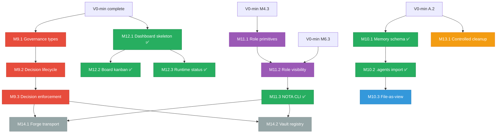

> Mirror source: `A:/my/obsidian/大吕/11-entrance/ENTRANCE ROADMAP.md`
> Imported into repo wiki: `2026-04-08`

# ENTRANCE ROADMAP — 冷归档

> **角色**: 项目级冷参考。活跃进度和会话上下文看 [ENTRANCE HANDOFF](./entrance-handoff.md)。
> **内容**: V0-min 完整历史、V1 future specs (D1-D6)、依赖图、完成清单、V2 延期事项。

---

# V0-min (Completed)

> V0-min milestone 已完成 (2026-04-04)。
> 详细 task specs 和审核记录归档在 prompts/v0-min/V0-min-complete-specs.md。
> MR Index 和设计决策保留在 ENTRANCE PANEL (Obsidian-only reference) 中。

---

# V1 Future Specs (D1-D6)

## V1 Locked Scope Decisions

| # | Question | Decision | Rationale |
|---|----------|----------|-----------|
| Q1 | Memory migration timing | **Parallel with V0-min** | .agents data outside Entrance is a risk; begin after A.2 |
| Q2 | Dashboard in V1 | **V1 stretch** | Basic dashboard in V1; graph-first vision in V2 |
| Q3 | Board plugin | **V1 core** | Linear uninstalled; Board kanban is the only task surface |
| Q4 | Governance lowering | **Full** | chat/learn/decide all go through compiler; no dead angles |
| Q5 | V1 size | **Adaptive** | Define exit criteria per domain; ship when ready |

---

## V1 Domain Map

| Domain | MR count | Nature | Depends on |
|--------|----------|--------|------------|
| D1: Decision/Governance Subsystem | 3 | New (extends V0-min compiler) | V0-min M5 |
| D2: Memory/Truth Migration | 3 | Migration + New | V0-min A.2 |
| D3: Control Plane / Org Model | 3 | New | V0-min M4, M6 |
| D4: Dashboard + Board | 3 | New (UI) | V0-min complete |
| D5: Scoped Destructive Ops | 1 | New | V0-min A.2 |
| D6: Plugin Hardening | 2 | Extend existing | V1 D1-D3 |
| **Total** | **15 MR** | | |

---

## V1 MR Index

| ID | Title | Executor | Domain |
|----|-------|----------|--------|
| **M9.1** | [Human] Governance action types in compiler | Human | D1 |
| **M9.2** | [Human] Decision lifecycle runtime | Human | D1 |
| **M9.3** | [Agent] Decision enforcement in invariant checks | Agent | D1 |
| **M10.1** | [Agent] Memory schema migrations | Agent | D2 | ✅ `ad50182` |
| **M10.2** | [Agent] Copy-only .agents import pipeline | Agent | D2 | ✅ `c3d6d6c` |
| **M10.3** | [Agent] File-as-view projection system | Agent | D2 |
| **M11.1** | [Human] Role primitives as runtime objects | Human | D3 |
| **M11.2** | [Human] Role-scoped visibility | Human | D3 |
| **M11.3** | [Agent] NOTA CLI enrichment | Agent | D3 | ✅ (NOTA CLI 130+ subcommands) |
| **M12.1** | [Human] Dashboard skeleton (SolidJS + Tauri) | Human | D4 | ✅ `7de2052` |
| **M12.2** | [Human] Board kanban plugin | Human | D4 | ✅ MR!26 (ENT-4) |
| **M12.3** | [Agent] Runtime status view | Agent | D4 | ✅ `df922fb` (G3) |
| **M13.1** | [Agent] Controlled cleanup capability | Agent | D5 |
| **M14.1** | [Agent] Forge transport integration | Agent | D6 |
| **M14.2** | [Agent] Vault registry integration | Agent | D6 |

**Total: 15 MR (Agent x9 / Human x6)**

---

## D1: Decision/Governance Subsystem

> V0-min builds the compiler for dispatch actions (do/dev). V1 extends to governance actions (chat/learn/decide).

---

### M9.1 -- [Human] Governance action types in compiler

| | |
|---|---|
| **Branch** | `feat/m9.1-governance-action-types` |
| **MR Title** | `M9.1: [Human] Governance action types in compiler` |
| **Objective** | Extend compiler to cover chat/learn/decide action primitives |
| **Depends on** | V0-min M5.3 (lowering enforcement) |

#### Done means

- `compiler/packet.rs` extended with governance action packet types:
  - `ChatPacket` -- conversational exchange (Human/NOTA boundary)
  - `LearnPacket` -- instinct/signal capture
  - `DecidePacket` -- decision proposal/acceptance/supersession
- Lowering pipeline handles governance actions alongside dispatch actions
- `compiler::lower_governance(role, request, context) -> Result<GovernancePacket>`
- Test: each governance action type lowers correctly

#### Files

| Action | File |
|--------|------|
| MODIFY | `core/compiler/packet.rs` -- add governance packet types |
| NEW | `core/compiler/governance.rs` -- governance lowering rules |
| MODIFY | `core/compiler/mod.rs` |

---

### M9.2 -- [Human] Decision lifecycle runtime

| | |
|---|---|
| **Branch** | `feat/m9.2-decision-lifecycle` |
| **MR Title** | `M9.2: [Human] Decision lifecycle runtime` |
| **Objective** | Decision as first-class runtime object with lifecycle |
| **Depends on** | M9.1 |

#### Done means

- Decision record is a runtime object, not a flat DB row:
  - Lifecycle: `proposed -> discussed -> accepted -> enforced -> superseded`
  - Each transition is a compiler-validated governance action
  - Provenance: who proposed, who accepted, source references
- `0018_create_decision_lifecycle_tables.sql` -- decision records with lifecycle state
- Vision record parallel structure (lighter lifecycle: `emerging -> active -> achieved -> archived`)
- CLI: `entrance decisions list`, `entrance decisions inspect <id>`, `entrance decisions propose`
- MCP: `decision_list`, `decision_inspect`, `decision_propose`
- Test: decision propose -> accept -> enforce lifecycle

#### Files

| Action | File |
|--------|------|
| NEW | `core/compiler/decision.rs` -- decision runtime object + lifecycle |
| NEW | `migrations/0018_create_decision_lifecycle_tables.sql` |
| MODIFY | `core/data_store.rs` -- decision CRUD |
| NEW | `cli/decision_cli.rs` |
| MODIFY | `cli/mod.rs` -- add decision dispatch |
| MODIFY | `core/mcp_server.rs` -- add decision tools |

---

### M9.3 -- [Agent] Decision enforcement in invariant checks

| | |
|---|---|
| **Branch** | `feat/m9.3-decision-enforcement` |
| **MR Title** | `M9.3: [Agent] Decision enforcement in invariant checks` |
| **Objective** | Runtime invariant checks reference accepted decisions |
| **Depends on** | M9.2 |

#### Done means

- `invariant_runtime.rs` queries accepted decisions for policy enforcement
- Violations against accepted decisions produce `IntegrityViolation` supervision signals (connects to V0-min M8)
- Superseded decisions do not enforce; only the currently active decision in each scope enforces
- Test: action that violates accepted decision -> rejection + supervision signal

#### Files

| Action | File |
|--------|------|
| MODIFY | `core/invariant_runtime.rs` -- decision-aware validation |
| MODIFY | `core/supervision.rs` -- decision violation classification |

---

## D2: Memory/Truth Migration

> Migrate .agents/nota/data/store.json (19 decisions, 5 visions, 20 todos, 39 fragments, 81 links) into Entrance DB. Non-destructive. DB is the canonical truth after migration.

---

### M10.1 -- [Agent] Memory schema migrations

| | |
|---|---|
| **Branch** | `feat/m10.1-memory-schema` |
| **MR Title** | `M10.1: [Agent] Memory schema migrations` |
| **Objective** | Create Entrance DB tables for the full NOTA memory model |
| **Depends on** | V0-min A.2 |

**Pre-research finding**: `data_store.rs` already has all Stored/Upsert structs AND CRUD methods for decisions, visions, todos, documents, memory_fragments, memory_links, instincts, coffee_chats. The SQL tables are the only missing piece. Tables use **unprefixed names** (matching existing CRUD code, not `nota_` prefixed).

#### Done means

- `migrations/0017_create_nota_memory_tables.sql` creates 8 tables:
  - `decisions`, `visions`, `todos`, `documents`
  - `memory_fragments`, `memory_links`
  - `instincts`, `coffee_chats`
- Migration registered in `CORE_MIGRATIONS` array (data_store.rs, 2 lines change)
- All existing CRUD methods now have corresponding tables
- Test: app starts without DB errors, basic CRUD round-trip works

#### Files

| Action | File |
|--------|------|
| NEW | `migrations/0017_create_nota_memory_tables.sql` |
| MODIFY | `core/data_store.rs` -- migration constant + array registration (2 lines) |

---

### M10.2 -- [Agent] Copy-only .agents import pipeline

| | |
|---|---|
| **Branch** | `feat/m10.2-agents-import` |
| **MR Title** | `M10.2: [Agent] Copy-only .agents import pipeline` |
| **Objective** | Import .agents/nota/data/store.json into Entrance DB |
| **Depends on** | M10.1 |

#### Done means

- `entrance memory import --source <path-to-store.json>` CLI command
- Reads store.json, inserts all records into corresponding `nota_*` tables
- **Copy-only**: source file is never modified or deleted (per D17)
- Import is idempotent: re-running skips existing records (by source_hash or id)
- Import report: counts of inserted/skipped per table
- Test: import store.json -> verify counts match source

#### Files

| Action | File |
|--------|------|
| NEW | `core/memory_import.rs` -- JSON parser + DB inserter |
| NEW | `cli/memory_cli.rs` |
| MODIFY | `cli/mod.rs` -- add memory dispatch |

---

### M10.3 -- [Agent] File-as-view projection system

| | |
|---|---|
| **Branch** | `feat/m10.3-file-projection` |
| **MR Title** | `M10.3: [Agent] File-as-view projection system` |
| **Objective** | specs/top/ and oracles/ become projections from DB truth |
| **Depends on** | M10.2 |

#### Done means

- `entrance memory export --target specs` regenerates specs/top/ from DB
- `entrance memory export --target oracles` regenerates oracles/ from DB
- Export is read-only on DB side; writes files only
- Projection freshness tracking: last export timestamp vs last DB write timestamp
- `entrance memory status` shows projection freshness (stale/fresh)
- Test: import -> modify DB -> export -> verify file reflects DB change

#### Files

| Action | File |
|--------|------|
| NEW | `core/memory_export.rs` -- DB -> file projection |
| MODIFY | `cli/memory_cli.rs` -- add export + status subcommands |

---

## D3: Control Plane / Org Model Runtime

> Make Leader/Manager/Agent/NOTA role primitives runtime objects, not just naming conventions.

---

### M11.1 -- [Human] Role primitives as runtime objects

| | |
|---|---|
| **Branch** | `feat/m11.1-role-primitives` |
| **MR Title** | `M11.1: [Human] Role primitives as runtime objects` |
| **Objective** | Model Leader/Manager/Agent/NOTA as first-class runtime types |
| **Depends on** | V0-min M4.3 (registry effective semantics) |

#### Done means

- `core/compiler/roles.rs` defines:
  - `RuntimeRole` enum -- Leader, Manager, Agent, NOTA, Human, Policy
  - `RoleCapability` -- what each role can do (action primitives, room access, governance rights)
  - `RoleContext` -- runtime-resolved role identity for a given session/allocation
- Compiler registry entries reference `RuntimeRole` for writer/reader policies
- Role capabilities derived from registry, not hardcoded
- Test: role capability lookup for each role type

#### Files

| Action | File |
|--------|------|
| NEW | `core/compiler/roles.rs` |
| MODIFY | `core/compiler/registry.rs` -- role-aware entries |
| MODIFY | `core/compiler/mod.rs` |

---

### M11.2 -- [Human] Role-scoped visibility

| | |
|---|---|
| **Branch** | `feat/m11.2-role-visibility` |
| **MR Title** | `M11.2: [Human] Role-scoped visibility` |
| **Objective** | Each role sees only what its policy allows |
| **Depends on** | M11.1, V0-min M6.3 (visibility reconstruction) |

#### Done means

- Visibility queries accept `RoleContext` as filter parameter
- Agent sees only its own allocations + receipts
- Manager sees all agents under its scope
- Leader sees everything
- NOTA sees Human-relevant projections (decisions, status, next steps)
- Visibility boundaries enforced by transport kernel, not UI filtering
- Test: same data, different role context -> different visibility sets

#### Files

| Action | File |
|--------|------|
| MODIFY | `core/compiler/transport.rs` -- role-filtered visibility |
| MODIFY | `core/compiler/routing.rs` -- role-aware routing |

---

### M11.3 -- [Agent] NOTA CLI enrichment

| | |
|---|---|
| **Branch** | `feat/m11.3-nota-cli-enrichment` |
| **MR Title** | `M11.3: [Agent] NOTA CLI enrichment` |
| **Objective** | NOTA CLI becomes the primary Human control surface |
| **Depends on** | M11.2 |

#### Done means

- `entrance nota` subcommands enriched:
  - `entrance nota overview` -- full runtime overview with role context
  - `entrance nota decisions` -- active decisions affecting current state
  - `entrance nota memory` -- memory summary (fragments, links, instincts count)
  - `entrance nota health` -- supervision signals, retry budgets, incident count
- All outputs use NOTA role visibility (Human-relevant projection only)
- MCP tools mirror CLI surface
- Test: each new subcommand returns valid output

#### Files

| Action | File |
|--------|------|
| MODIFY | `cli/nota_cli.rs` -- add overview/decisions/memory/health subcommands |
| MODIFY | `core/mcp_server.rs` -- add corresponding tools |

---

## D4: Dashboard + Board

> V1 delivers a basic dashboard skeleton and Board kanban. Graph-first topology/runtime visualization is V2.

---

### M12.1 -- [Human] Dashboard skeleton (SolidJS + Tauri)

| | |
|---|---|
| **Branch** | `feat/m12.1-dashboard-skeleton` |
| **MR Title** | `M12.1: [Human] Dashboard skeleton` |
| **Objective** | Establish the dashboard shell with sidebar navigation |
| **Depends on** | V0-min complete |

#### Done means

- SolidJS frontend bootstrapped in `src/` (pnpm + Tauri 2.0 webview)
- Dashboard main window with sidebar navigation:
  - Overview (runtime status summary)
  - Board (kanban -- M12.2)
  - Decisions (list view)
  - Memory (search + browse)
- Tauri IPC bridge established: frontend can call Rust commands
- Design: dark mode, modern typography, information-dense
- Test: `pnpm dev` renders dashboard with sidebar navigation

#### Files

| Action | File |
|--------|------|
| NEW | `src/App.tsx` -- main app shell |
| NEW | `src/components/Sidebar.tsx` |
| NEW | `src/pages/Overview.tsx` |
| NEW | `src/pages/Decisions.tsx` |
| NEW | `src/pages/Memory.tsx` |
| MODIFY | `src-tauri/src/commands/mod.rs` -- Tauri IPC commands |

---

### M12.2 -- [Human] Board kanban plugin

| | |
|---|---|
| **Branch** | `feat/m12.2-board-kanban` |
| **MR Title** | `M12.2: [Human] Board kanban plugin` |
| **Objective** | Kanban board as Entrance's native task surface (replaces Linear) |
| **Depends on** | M12.1 |

#### Done means

- Board plugin schema:
  - `0020_create_board_tables.sql`: board_items (title, status, priority, assignee_role, project, description, created_at, updated_at)
  - Status columns: Backlog, In Progress, Review, Done
- Board UI: drag-and-drop kanban (SolidJS)
- Board CLI: `entrance board list`, `entrance board add`, `entrance board move`
- Board MCP: `board_list`, `board_add`, `board_move`
- Board is the canonical task surface; should feel as good as Linear
- Test: CRUD + drag-drop + CLI round-trip

#### Files

| Action | File |
|--------|------|
| NEW | `migrations/0020_create_board_tables.sql` |
| NEW | `src/pages/Board.tsx` |
| NEW | `src/components/KanbanColumn.tsx` |
| NEW | `src/components/KanbanCard.tsx` |
| NEW | `cli/board_cli.rs` |
| MODIFY | `core/data_store.rs` -- board CRUD |
| MODIFY | `core/mcp_server.rs` -- board tools |
| MODIFY | `cli/mod.rs` -- add board dispatch |

---

### M12.3 -- [Agent] Runtime status view

| | |
|---|---|
| **Branch** | `feat/m12.3-runtime-status-view` |
| **MR Title** | `M12.3: [Agent] Runtime status view` |
| **Objective** | Dashboard Overview page shows live runtime status |
| **Depends on** | M12.1 |

#### Done means

- Overview page displays:
  - Current human round state
  - Active allocations count
  - Pending supervision signals
  - Recent decisions
  - Checkpoint status (landed/remaining)
  - Anti-Zeno progress indicator
- Data sourced from Tauri IPC -> Rust runtime queries
- Auto-refresh on runtime state changes
- Test: runtime state changes -> Overview reflects within 1s

#### Files

| Action | File |
|--------|------|
| MODIFY | `src/pages/Overview.tsx` -- runtime data display |
| NEW | `src-tauri/src/commands/runtime_status.rs` -- IPC queries |
| MODIFY | `src-tauri/src/commands/mod.rs` |

---

## D5: Scoped Destructive Operations

> Replace raw directory deletion with Entrance-governed capability.

---

### M13.1 -- [Agent] Controlled cleanup capability

| | |
|---|---|
| **Branch** | `feat/m13.1-controlled-cleanup` |
| **MR Title** | `M13.1: [Agent] Controlled cleanup capability` |
| **Objective** | Resource-level cleanup with preview/approval/audit |
| **Depends on** | V0-min A.2 |

#### Done means

- `entrance cleanup preview --target <resource>` -- shows what would be deleted without acting
- `entrance cleanup execute --target <resource> --confirm` -- performs deletion with audit trail
- Resource types: `worktree`, `cache`, `snapshots`
- Pre-checks: running tasks on target, uncommitted changes, untracked files
- Audit: cleanup events logged in DB with timestamp, target, outcome
- **No raw `Remove-Item -Recurse` anywhere** -- all deletion goes through this capability
- Test: preview -> execute -> verify audit trail + files removed

#### Files

| Action | File |
|--------|------|
| NEW | `core/cleanup.rs` -- controlled cleanup engine |
| NEW | `cli/cleanup_cli.rs` |
| NEW | `migrations/0021_create_cleanup_audit_tables.sql` |
| MODIFY | `core/data_store.rs` -- cleanup audit CRUD |
| MODIFY | `cli/mod.rs` -- add cleanup dispatch |

---

## D6: Plugin Hardening

> Forge and Vault integrate with V0-min/V1 internals.

---

### M14.1 -- [Agent] Forge transport integration

| | |
|---|---|
| **Branch** | `feat/m14.1-forge-transport` |
| **MR Title** | `M14.1: [Agent] Forge transport integration` |
| **Objective** | Forge tasks produce admission records visible in transport kernel |
| **Depends on** | V1 D1-D3 |

#### Done means

- Forge task dispatch creates admission records (connects to V0-min M6.1)
- Task completion produces return packets routed through transport kernel
- Forge task state changes classified as supervision signals (connects to V0-min M8)
- MCP: forge tools return typed transport kernel status, not just flat strings
- Test: Forge dispatch -> admission -> completion -> return routing correct

#### Files

| Action | File |
|--------|------|
| MODIFY | `core/forge_runtime.rs` -- transport kernel integration |
| MODIFY | `core/compiler/admission.rs` -- Forge-aware admission |

---

### M14.2 -- [Agent] Vault registry integration

| | |
|---|---|
| **Branch** | `feat/m14.2-vault-registry` |
| **MR Title** | `M14.2: [Agent] Vault registry integration` |
| **Objective** | Vault stores agent skill contracts referenced by compiler registry |
| **Depends on** | V1 D1-D3 |

#### Done means

- Vault skill entries reference compiler registry `ObjectKind` and `ControlPolicy`
- Compiler can resolve skill capabilities from Vault entries
- MCP server skill discovery uses Vault as source
- Test: register skill in Vault -> compiler resolves its capabilities

#### Files

| Action | File |
|--------|------|
| MODIFY | `core/vault_runtime.rs` -- registry-aware skill storage |
| MODIFY | `core/compiler/registry.rs` -- Vault-backed capability resolution |

---

## V1 Dependency Graph



---

## V1 Parallel Execution Strategy

D2 (Memory migration) and D5 (Cleanup) can start after V0-min A.2 -- independent of compiler work.

D1, D3, D6 depend on V0-min completion.

D4 (Dashboard) depends on V0-min completion but can overlap with D1/D3.

```
V0-min Phase                              V1 Phase
+-----------+                 +-------------------------------+
| A.1 - M8.3 |  (sequential) | D1: M9.1-M9.3               |
|  16 MR     |                | D3: M11.1-M11.3             |
|  4-7 weeks |                | D4: M12.1-M12.3             |
+-----------+                 | D6: M14.1-M14.2             |
       |                      +-------------------------------+
       +-- after A.2 ---------+-- D2: M10.1-3                |
                              +-- D5: M13.1                  |
                              +-------------------------------+
                              V1 estimate: 4-6 weeks after V0-min
                              + D2/D5 early start saves ~2 weeks
```

---

## V1 Completion Checklist

All must be true for V1 completion:

- [ ] M9.3 merged -- governance actions fully compiled, decisions enforce invariants
- [x] M10.2 merged -- .agents data fully imported into Entrance DB *(D2/M10.2 ✅ `c3d6d6c`)*
- [ ] M10.3 merged -- specs and oracles are DB projections, not authoring planes
- [ ] M11.3 merged -- NOTA CLI is complete Human control surface
- [x] M12.2 merged -- Board kanban replaces Linear as task surface *(ENT-4 Issue Tracker ✅ MR!26 — native SQLite Kanban replaces Linear)*
- [x] M12.3 merged -- Dashboard shows live runtime status *(G3 Console + G2 ComputeGraph ✅ — runtime tree + health + budget)*
- [ ] M13.1 merged -- no raw directory deletion; all cleanup goes through `entrance cleanup`
- [ ] M14.1 merged -- Forge tasks produce admission records and supervision signals
- [x] `entrance nota status` all invariants green *(2C Heartbeat + NOTA runtime ✅)*
- [x] `entrance nota decisions` returns imported decisions *(NOTA CLI enrichment ✅)*
- [x] `entrance board list` returns tasks *(replaced by `entrance issues list` — ENT-4 ✅ MR!26)*
- [x] `cargo test --lib` all green *(244/244 tests pass)*

---

## Completed via HANDOFF (not through original MR plan)

> The following V1 items were delivered through iterative Handoff sessions rather than the originally planned MR-per-spec path. Cross-reference [ENTRANCE HANDOFF](./entrance-handoff.md) for commit hashes and details.

| Original Spec | Delivered As | MR/Commit |
|---------------|-------------|-----------|
| M10.1 Memory schema | D2/M10.1 NOTA Memory 8 tables | ✅ `ad50182` |
| M10.2 .agents import | D2/M10.2 store.json import pipeline | ✅ `c3d6d6c` |
| M11.3 NOTA CLI | 130+ NOTA CLI subcommands (overview, status, allocations, receipts, do, dev, review, etc.) | ✅ multiple |
| M12.1 Dashboard | Dashboard + ComputeGraph + NOTA Dialog | ✅ `7de2052` |
| M12.2 Board kanban | **ENT-4 Issue Tracker** — native SQLite Kanban (replaces Linear) | ✅ MR!26 |
| M12.3 Runtime status | G3 Operations Console (instance tree + health + budget) | ✅ `df922fb` |
| — | ENT-4 Forge De-Linearization (local DB first) | ✅ MR!26 |
| — | ENT-4 Issue CLI (`entrance issues list/get/create/...`) | ✅ MR!26 |
| — | ENT-4 MCP tools (issues_list/get/create/update_status/add_comment) | ✅ MR!26 |
| — | UI: Split-Pane Layout fix (Issues + Board) | ✅ MR!26 |

---

## Explicit V2 Deferrals

| Item | Reason |
|------|--------|
| Distributed layer (heartbeat, worker/node, Mesh plugin) | Discussion-status todos 8/10/11; premature to freeze |
| WASM plugin runtime | Static compilation sufficient for V1 |
| Semantic/vector retrieval | Requires embedding infrastructure |
| Connector plugin (S3 in oracle) | Not critical path |
| Mobile/IM surfaces | Vision V4 is long-horizon |
| Graph-first dashboard topology view | V5 vision is mid-horizon; basic dashboard first |
| Multi-Arch/Multi-Dev scaling | Org still 1 CEO -> 1 Arch -> 1 Dev -> N Agents |

---

# END